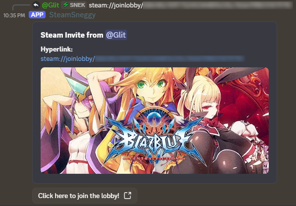

# SteamSneggy

Simple discord bot to create clickable steam links.

# Installation

Currently, since this bot is still early in development, it is not available for public Discord installation. If you'd like it in your server, please reach out to me (`@Systematical`) on discord. Hell, feel free to put one up yourself, it's not hard. See the Manual Use Instructions section at the bottom.

# About

There are two components: the discord bot and the server.

## Discord Bot

### Steam Redirect Messages

The discord bot sits in a server and listens to all messages that are sent. It _only_ looks for messages that contain a component that exactly matches a steam link:

```
steam://joinlobby/(?P<game_id>[\d]+)/(?P<unique_id>[\d]+)/(?P<user_id>[\d]+)
```

A steam link is comprised of 3 parts, a `game_id`, `unique_id` (room id?) and a `user_id`. It _specifically_ looks for and breaks up into these three components, and then generates a URL that contains these three ids as url parameters:

```
http://[host]/join?id1=[game_id]&id2=[unique_id]&id3=[user_id]
```

It then responds to the original message with a link to the new URL, while containing the text of the original steamlobby so it's obvious what it's linking to. It also pings the original author of the steam lobby link message, as well as anyone they mentioned or they replied to.


It also queries the Steam endpoints to fetch the name of the game and its store page logo, to make the message look prettier.

### Health Check

The bot also checks that it can connect to the server every time it sees a steam join lobby link. If it doesn't get an OK message back, it changes its status to DND and has a small message to let people know it's not operational, but doesn't respond to the original message.

This is to reduce the amount of spam, so even if the bot is non-functional people can keep putting their steam lobby links without a slew of "Teehee oops I can't connect!" messages.

## Server

The server is a very simple API service. It has two endpoints, currently:
```
/health
/join/
```

`/health` exists solely to be an endpoint for the discord bot to check that it can communicate with the server as it has been configured to. It responds OK.

`/join/` is the main bot functionality. It takes three IDs, the `game_id`, `unique_id`, and `user_id` mentioned above, and redirects the user to:

```
steam://joinlobby/[game_id]/[unique_id]/[user_id]
```

### Why reconstruct the URL?

You may be wondering why I specifically break out and pass these three IDs. Well, the answer is simple: otherwise, I'm literally just taking any possible string and forwarding the user to it. This has the potential to lead to a whole slew of security issues and string parsing safety issues, so instead I've made it so it only ever looks for three integers and then recreates the steam url itself.

# Other Notes

## Thanks

Thanks to the original developer of ShuuBox for the idea. Huge thanks to my friend for the help with learning to develop discord bots and handle APIs and his constant advice.

## Usage

Feel free to use this bot and copy it and ugprade it, though I'd be really interested to see what else you do with it so maybe I can learn from it too. I'm not sure what I'll do if this bot actually gets popular, because then I'll need to deal with discord app verification stuff.

Note that I did throw an MIT License on it, so just note that you used my work if you end up making your own version using my code.

## Lobby Link Message Format

I'm also taking suggestions for lobby link message format suggestions. Originally, I had a much bigger message with a "Click me to join lobby!" button and a big ol' game image banner, but this would have been absurd in a matchmaking server (like it was initially intended for.)



For a little bit, I considered letting servers choose which style of lobby link to use, but that ended up needing SEVEN!! new commands (message_type, add/remove/list users with permissions, add/remove/list roles with permissions) because now all of a sudden it needed to care who was talking to it. And, I just couldn't be certain that whoever was using it would know/care to know how to use CLI-style commands, so I nuked all of them and everyone's gotta deal with the same message now.

If I end up extending the bot a lot (to the point I add back persistent storage and add some web interface/dashboard), I may add back message style choosing and maybe even customization. But that's a future me problem and may be a whole separate bot at this point.

## Future Endpoints

I'm going to add a landing page that just gives a little tl;dr about the bot and links to this github repo for anyone who somehow goes to the base endpoint.

I may also have to add a ToS and a Privacy Policy endpoint if this bot ends up in enough servers.

# Manual Use Instructions

I develop with `uv`. I highly recommend it.

In the root directory, run `uv sync` to install all dependencies, then run `make run_server` and `make run_discord` to run the server and discord components.

You'll need a CONFIG file too. Use `CONFIG_EX` as an example; save your customized `CONFIG` as `CONFIG` in the root directory if you're using the make command to run the bot.

If you're running the bot manually, use:
```
uv run python3 src/steamjoin_discord/__main__.py --config [config file]
uv run fastapi run src/steamjoin_server/__init__.py
```

You can look in `pyproject.toml` to see dependencies, but tl;dr you just need:

```
argparse
configparse
discord-py
fastapi
requests
```